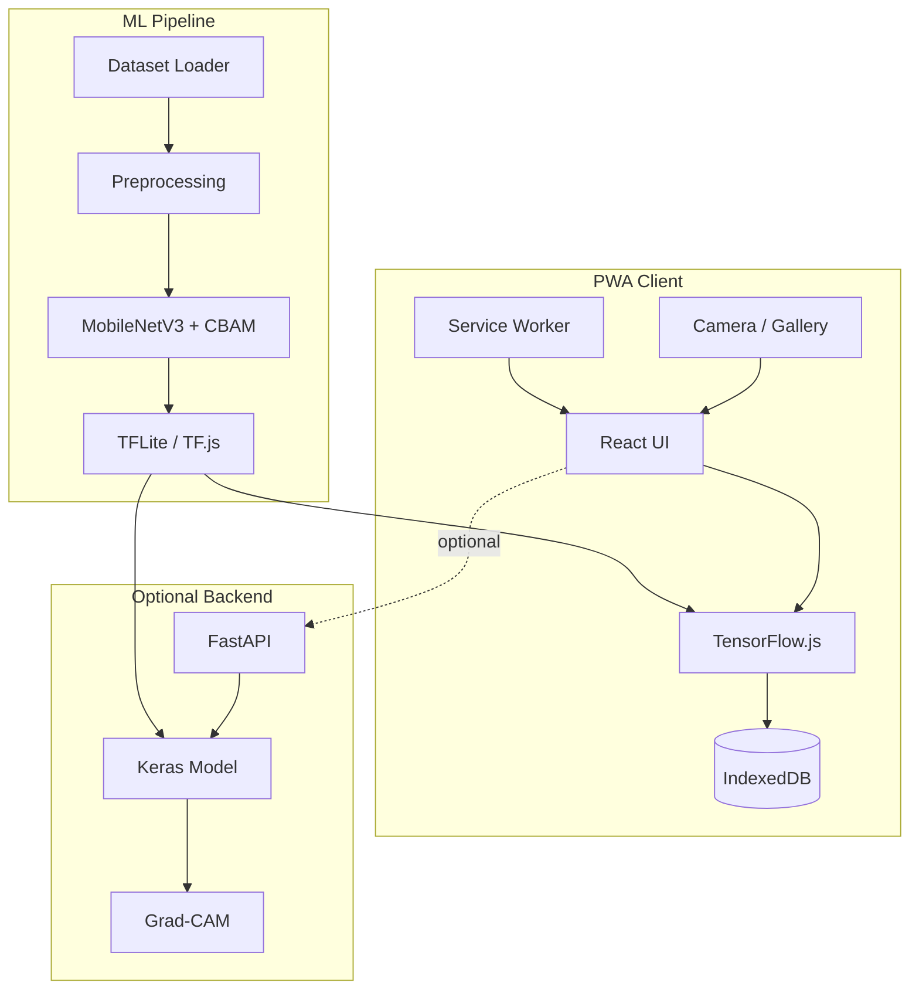
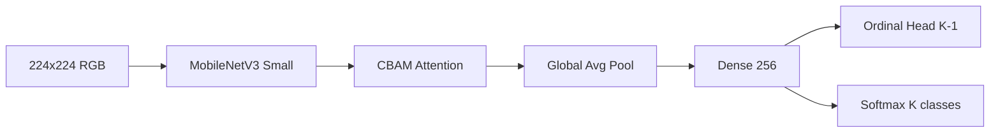

# System Architecture

## High-Level Design

## Model Architecture

## Data Flow (Inference)

1. Capture/upload intraoral image
2. Preprocess: ROI crop → CLAHE → specular reduction → resize
3. TF.js inference (<1s target)
4. Grad-CAM heatmap + contour overlay
5. Encrypt & save to IndexedDB
6. Display ICDAS grade + clinical action

## Component Responsibilities

| Module | Responsibility |
|--------|----------------|
| `ml/src/preprocessing.py` | Image normalization |
| `ml/src/model.py` | Architecture definition |
| `ml/src/gradcam.py` | Explainability |
| `frontend/src/services/inference.ts` | Edge inference |
| `frontend/src/services/storage.ts` | Offline persistence |
| `backend/app/inference.py` | Server-side inference |

## Privacy Architecture

- Default: 100% on-device
- Encryption: Web Crypto AES-GCM
- No external network calls in offline mode
- Backend disabled unless user opts in
