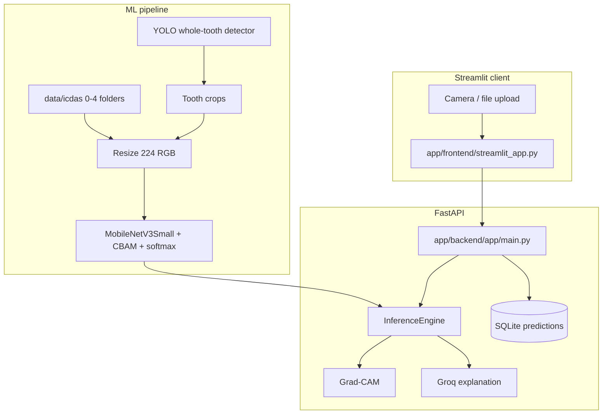

# System Architecture

FDI numbering is **out of scope**. Active flow: RGB photo → whole-tooth detection → crop → ICDAS 0–4 → Grad-CAM → report (`docs/PROJECT_SCOPE.md`).

## High-Level Design

## Model Architecture

Production output is **5-class softmax** (ICDAS 0–4). An ordinal head still exists in `ml/src/model.py` when `ordinal_regression=true` and is not used for production inference.

## Data Flow (Inference)

1. Capture/upload intraoral image (Streamlit)
2. Decode RGB, optional ROI/CLAHE/specular (all **off** in the current config)
3. Resize to 224×224, keep pixels in **[0, 255]**
4. Keras softmax → ICDAS grade 0–4
5. Grad-CAM heatmap + contour overlay
6. Groq writes an explanation of the **model** grade
7. Store the prediction in SQLite

## Component Responsibilities

| Module | Responsibility |
|--------|----------------|
| `ml/src/preprocessing.py` | Training-time resize to RGB `[0, 255]` |
| `ml/src/model.py` | MobileNetV3Small + CBAM + softmax (default) |
| `ml/src/gradcam.py` | Training/research Grad-CAM helper |
| `app/frontend/streamlit_app.py` | UI; does not compute ICDAS grades |
| `app/backend/app/inference.py` | Server-side inference and Grad-CAM |

## Privacy Architecture

- Images and predictions are stored by the FastAPI backend (local SQLite by default).
- Groq is optional; if `GROQ_API_KEY` is missing, a local report is used.
- This prototype is not a HIPAA product.
